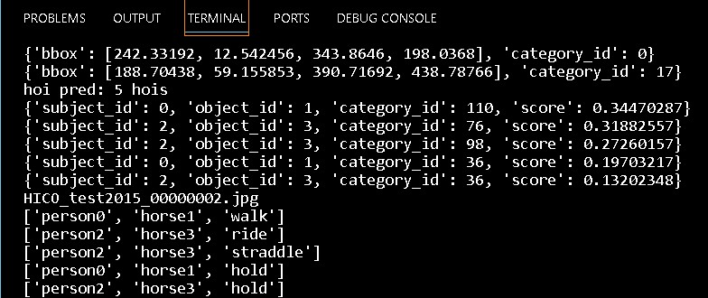

# HOI-demo-for-CDN
demo scripts for CDN algorithm

关于人物交互(HOI)，相继提出了很多算法。但是算法的code中没有demo文件。这里针对于[CDN算法](https://github.com/YueLiao/CDN.git)写了一下demo的脚本，由于HOI算法代码结构相似，稍加修改后也可以用于其他算法。

* 对于单张图片的预测
* 预测结果的可视化
* 标注格式以及动作/物体种类基于HICO-Det数据集(详见annotation文件夹)

#### 可视化效果
对单张图片进行预测，基于数量过滤，选择score最高的五个hoi对



下面详细介绍各脚本的功能

#### [predictor.py](./utils/predictor.py)

基于CDN算法中对于HICODet数据集的eval方法，加以修改得到的对于单张任意图片的predict方法。
`model` 为读入的预训练模型，`correct_mat_path` 是对应于HICODet数据集的匹配矩阵，`source`是输入图片的路径
```python
class Predictor:
    def __init__(self,model,postprocessors,correct_mat_path,args) -> None:
        pass
    def predict(self,source):
        ...
        return preds
```
#### [demo_utils.py](./utils/demo_utils.py)
* `filter_res_score` 基于hoi对的`score`进行过滤，保留`score`大于`thre`的所有pair
* `filter_res_num` 基于数量过滤。按照`score`值从大到小排序，保留前`num`个pair
* `show_hoi` 将`preds`中的数据格式，结合物体/动作的对应编号，转化为自然语言词汇后输出
    * `obj_path` 和 `verb_path` 为编号文件的路径

#### [demo.py](./utils/demo.py)
* 在执行区域设置参数，参数设置和CDN的规则一样。需要注意，有一些参数可能是无用的！(因为我懒得一个个改了，直接复制过来的)
* 使用`Demo`类进行推理和可视化
* obj_path,verb_path为类别和动作的map文件路径
~~~python
class Demo:
    def __init__(self,predictor,output_dir,obj_path,verb_path):
        ...
~~~

---


如有补充或疑问，欢迎联系 3031864345@qq.com

---
### About Human-Object Interaction (HOI) Predictor with Demo Script

Several algorithms have been proposed for Human-Object Interaction (HOI), but some algorithm codes lack demo files. Here, a demo script is provided specifically for the [CDN algorithm](https://github.com/YueLiao/CDN.git). With slight modifications, it can be adapted for other similar HOI algorithms.

- **Single Image Prediction**
- **Visualization of Prediction Results**
- **Annotation Format and Action/Object Categories based on the HICO-Det Dataset (see the annotation folder)**

#### Visualization Effects
Prediction on a single image, filtering based on quantity, selecting the top five HOI pairs with the highest scores.


Below, detailed descriptions of each script's functionality are provided:

#### [`predictor.py`](./utils/predictor.py)

Derived from the evaluation method for the HICODet dataset within the CDN algorithm, this script has been modified to create a `predict` method for predicting on any single image.
`model` refers to the pre-trained model read in, `correct_mat_path` corresponds to the matching matrix for the HICODet dataset, and `source` denotes the input image path.
```python
class Predictor:
    def __init__(self,model,postprocessors,correct_mat_path,args) -> None:
        pass
    def predict(self,source):
        ...
        return preds
